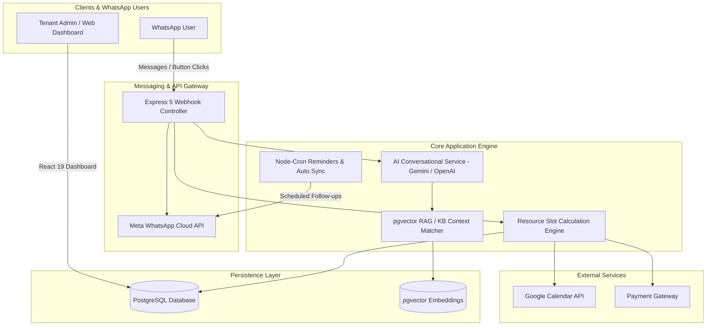

# Wizzo AI (ADHUD) — Multi-Tenant AI Automation & Smart Booking Platform
## Developer Portfolio Project Report & Case Study

---

## 📌 Executive Summary

**Wizzo AI (ADHUD)** is an enterprise-grade, multi-tenant SaaS platform engineered to transform client acquisition, customer support, and appointment scheduling for service-based businesses (e.g., salons, wellness centers, healthcare clinics). 

By seamlessly integrating Meta's **WhatsApp Cloud API** with **Generative AI models (Google Gemini & OpenAI)**, **vector-based Retrieval-Augmented Generation (pgvector RAG)**, and an intelligent **resource allocation engine**, Wizzo AI automates end-to-end customer interactions. It handles natural conversational queries, calculates real-time appointment availability based on staff and physical chair constraints, collects payments via dynamic link generation, and auto-syncs with Google Calendar.

The platform provides a dual-dashboard interface: a high-performance **Tenant Dashboard** built with React 19 and Framer Motion for business managers, and a centralized **SuperAdmin Portal** for tenant provisioning, system monitoring, and global platform configuration.

---

## 🛠️ Technical Stack Overview

| Layer | Technologies & Frameworks |
| :--- | :--- |
| **Frontend Framework** | React 19, Vite 8, React Router v7 |
| **Styling & Motion** | TailwindCSS v4, Framer Motion v12, Spline 3D (`@splinetool/react-spline`), Lucide React |
| **Backend Runtime** | Node.js (ES Modules), Express.js (v5) |
| **Database & ORM/Driver** | PostgreSQL (`pg`), `pgvector` (Vector Search for RAG Context) |
| **Artificial Intelligence** | Google Generative AI (`@google/generative-ai` Gemini 1.5/2.0), OpenAI API |
| **Messaging & Messaging** | Meta WhatsApp Business Cloud API (Webhooks, Templates, Interactive Buttons) |
| **Integrations & Services** | Google Calendar API, PDFKit (Invoice Generation), `pdf-parse`, Nodemailer |
| **Task Scheduling & Auth** | `node-cron`, JSON Web Tokens (JWT), BcryptJS |

---

## 🎯 Key Problems Solved & Business Value

1. **24/7 Automated Customer Support & Booking**: Eliminates manual receptionist overhead by deploying tenant-specific AI agents that answer FAQs, process bookings, and answer service inquiries via WhatsApp.
2. **Resource-Aware Dynamic Scheduling**: Unlike standard calendars, Wizzo calculates availability matrix based on service duration, assigned staff availability, AND physical resource limits (e.g., salon chair capacity).
3. **Instant Document & KB Context Ingestion**: Businesses can upload PDFs/manuals. The system extracts text, chunks it, and uses `pgvector` to inject accurate context into the AI model for hyper-accurate business responses.
4. **Automated Conversion & Payment Collection**: Sends dynamic payment links, auto-generates downloadable PDF invoices, and tracks payment statuses via webhooks.
5. **No-Code Multi-Tenant Provisioning**: SuperAdmins can provision new business tenants with custom subdomains, WABA account bindings, and isolated vertical configurations in seconds.

---

## 🏗️ System Architecture & Workflow

---

## 🌟 Detailed Feature Breakdown

### 1. AI-Powered WhatsApp Bot Engine (`webhookController.js` & `aiService.js`)
* **State Machine Webhook Handler**: High-concurrency event processor for incoming Meta webhooks (text, button quick-replies, list selections, and media).
* **Dual-AI Provider Strategy**: Leverages Google Gemini and OpenAI for fast fallback, context retention, and multi-turn conversational dialogue.
* **Interactive WhatsApp Templates**: Sends interactive rich messages (Service Catalog Lists, Chair/Slot pickers, Booking confirmation buttons).

### 2. Multi-Tenant Resource & Slot Management (`bookingFlowService.js`)
* **Multi-Constraint Availability Algorithm**: Solves complex scheduling equations considering:
  - Business operating hours & break intervals.
  - Service execution duration + buffer time.
  - Specific staff member shifts and assigned bookings.
  - Available salon chairs / physical workstation capacity.
* **Double-Booking Prevention**: Enforces transaction safety to avoid overbooking resources.

### 3. Knowledge Base & Vector RAG Ingestion (`kbController.js` & `schema.sql`)
* **PDF & Document Parsing**: Business owners can upload PDFs containing pricing rules, policies, and FAQs.
* **Vector Search with `pgvector`**: Text is converted into vector chunks for fast similarity matching, allowing the AI to answer business-specific queries without hallucination.

### 4. Interactive Web Dashboard (`Dashboard.jsx` & `SuperAdmin.jsx`)
* **Business Command Center**: Interactive calendar view, appointment management, live conversation monitoring, custom prompt tuning, and revenue metrics.
* **Modern Aesthetic UI**: Designed with React 19, Framer Motion animations, Spline 3D canvas rendering, and dark-themed glassmorphism.
* **SuperAdmin Oversight**: Centralized management of tenant databases, subscription lifecycles, and WABA (WhatsApp Business Account) allocations.

### 5. Automated Payments, Invoicing & Reminders
* **PDF Invoice Generator**: Creates professional invoices dynamically using `pdf-parse` / `pdfkit` and emails or delivers them over WhatsApp.
* **Cron-Based Notifications**: Automatically triggers appointment reminders, follow-up messages, and subscription expiry alerts via `node-cron`.

---

## 📊 Database Schema Highlights (`schema.sql`)

* **`tenants`**: Tenant profile, custom subdomain, business vertical, status, and subscription parameters.
* **`waba_accounts` & `phone_numbers`**: Meta WhatsApp Business Account linkages and numbers.
* **`services`, `staff_members`, `salon_chairs`**: Resource modeling entities.
* **`bookings` & `booking_items`**: Appointment status, service mappings, time slots, and chair allocations.
* **`kb_documents` & `kb_chunks`**: Vector-enabled knowledge base tables with `vector` extension support.
* **`payments` & `invoices`**: Transaction records, payment link states, and PDF metadata.

---

## 💼 Developer Portfolio & Resume Ready Assets

### 🔹 Resume Bullet Points (Copy & Paste for CV)
* **Architected and developed Wizzo AI**, a multi-tenant SaaS platform integrating Meta WhatsApp Cloud API with Google Gemini and OpenAI to automate client bookings and support for service businesses.
* **Built a complex multi-constraint slot scheduling engine** in Node.js/Express handling staff schedules, service durations, and physical salon chair capacities to eliminate double-booking.
* **Implemented a RAG-based Knowledge Base System** using PostgreSQL `pgvector` and `pdf-parse`, enabling AI bots to query custom tenant documentation with context-aware responses.
* **Designed a responsive React 19 dashboard** with Framer Motion, Spline 3D animations, and dynamic analytics for tenant business management and SuperAdmin platform operations.
* **Engineered a resilient webhook handler** with state-machine dialog flows, interactive WhatsApp message templates, automated PDF invoice generation (`pdfkit`), and Google Calendar API synchronization.

---

### 🔹 LinkedIn Project Showcase Description

> 🚀 **Excited to share Wizzo AI (ADHUD)** — an AI-powered Multi-Tenant Automation & Smart Booking Platform built with React 19, Node.js, PostgreSQL (`pgvector`), Meta WhatsApp Cloud API, and Google Gemini / OpenAI!
> 
> 🔹 **What it does:**
> Wizzo AI enables service businesses (salons, clinics, consultancies) to deploy 24/7 intelligent WhatsApp AI agents that answer customer inquiries, parse custom PDF manuals, calculate real-time slot availability (considering staff & physical chair limits), process payments, and sync with Google Calendar.
> 
> 🔹 **Tech Highlights:**
> • **Frontend**: React 19, Vite, Framer Motion, TailwindCSS v4, Spline 3D
> • **Backend**: Express 5, Node.js, `pgvector`, Node-Cron, PDFKit
> • **AI & Messaging**: Google Gemini API, OpenAI, Meta WhatsApp Cloud API
> • **Architecture**: Multi-tenant database design with RAG knowledge ingestion
> 
> Check out the project architecture and features! 💡 #ReactJS #NodeJS #ArtificialIntelligence #WhatsAppAPI #SaaS #FullStack #PostgreSQL

---

### 🔹 Technical Interview Q&A Talking Points

1. **Q: How did you handle multi-tenancy in the database?**
   * *A:* We implemented a tenant isolation model using `tenant_id` foreign key relations and jsonb settings configurations, accompanied by a provisioning service capable of dynamically linking tenant subdomains to unique configuration scopes and WABA phone numbers.
2. **Q: How does the dynamic booking slot algorithm work?**
   * *A:* The algorithm takes the service duration, queries staff operating hours and current bookings, checks physical resource availability (e.g., available salon chairs), computes overlapping time intervals, and returns only conflict-free slots.
3. **Q: How did you prevent AI hallucination for business FAQs?**
   * *A:* We built a Retrieval-Augmented Generation (RAG) pipeline using `pgvector` in PostgreSQL. Tenant documents (PDFs) are chunked and vectorized. When a user asks a question on WhatsApp, relevant text context is retrieved from the vector database and injected into the Gemini/OpenAI prompt.

---

## 📁 File Reference & Codebase Map

* [server/index.js](file:///d:/Siyad/wizzo_adhud/server/index.js) — Server entry point & Express route mounting.
* [server/controllers/webhookController.js](file:///d:/Siyad/wizzo_adhud/server/controllers/webhookController.js) — Main WhatsApp webhook engine & state processing (~140KB).
* [server/services/aiService.js](file:///d:/Siyad/wizzo_adhud/server/services/aiService.js) — Gemini & OpenAI integration logic.
* [server/services/bookingFlowService.js](file:///d:/Siyad/wizzo_adhud/server/services/bookingFlowService.js) — Smart slot calculation & scheduling logic.
* [server/data/schema.sql](file:///d:/Siyad/wizzo_adhud/server/data/schema.sql) — Full PostgreSQL database schema & pgvector setup.
* [client/src/pages/Dashboard.jsx](file:///d:/Siyad/wizzo_adhud/client/src/pages/Dashboard.jsx) — Multi-tenant admin dashboard UI (~280KB).
* [client/src/pages/admin/SuperAdmin.jsx](file:///d:/Siyad/wizzo_adhud/client/src/pages/admin/SuperAdmin.jsx) — SuperAdmin platform control panel.
